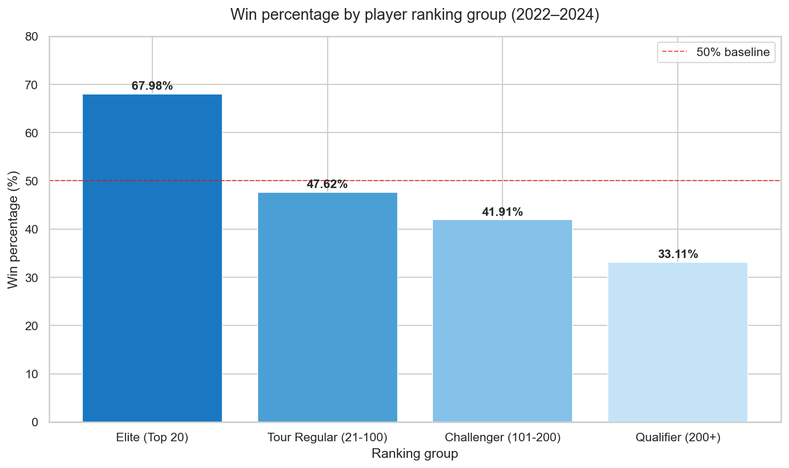
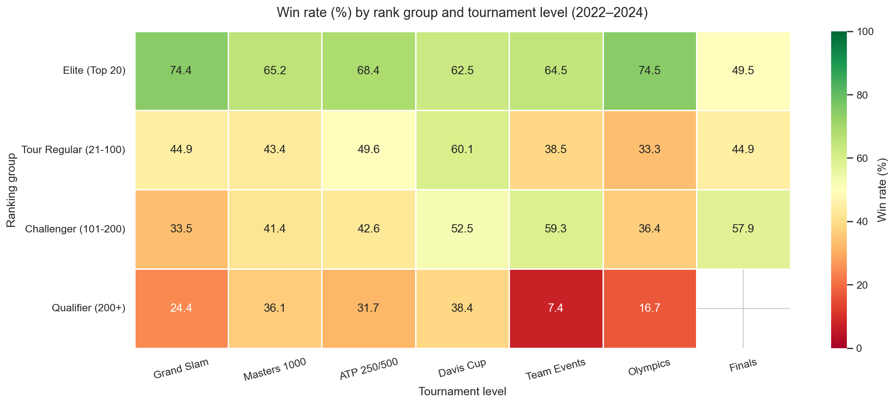
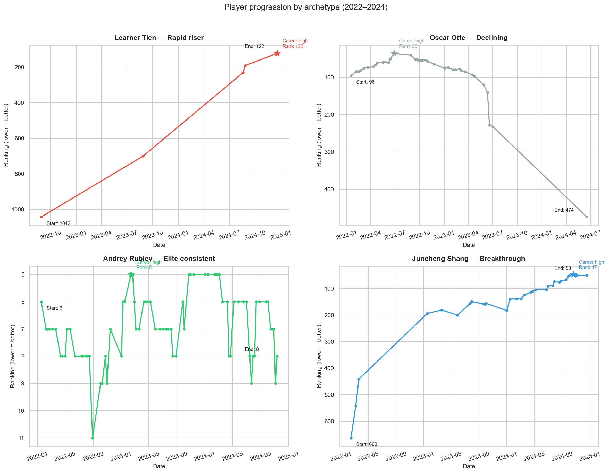
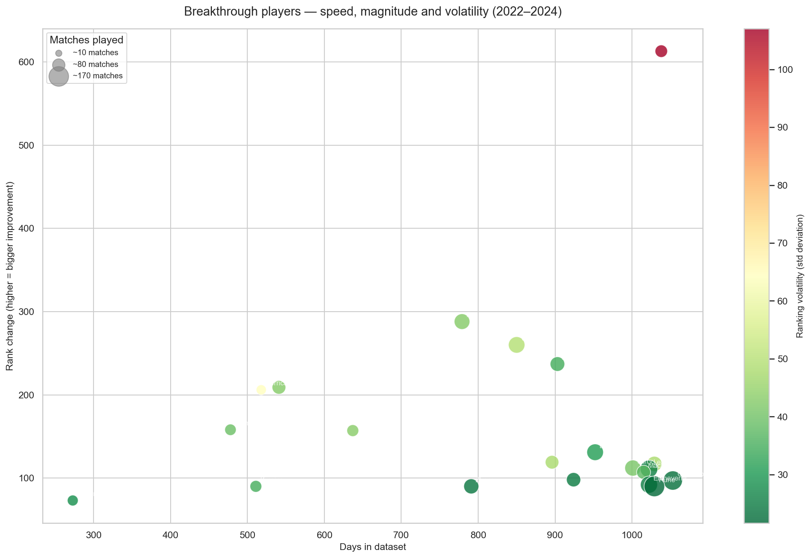
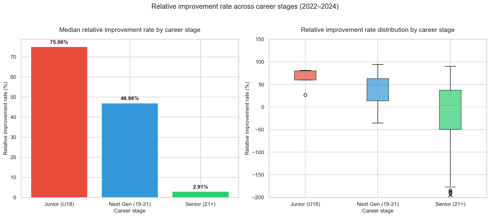
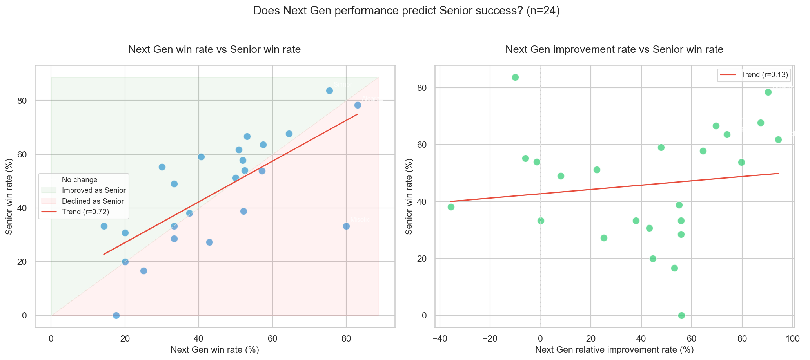
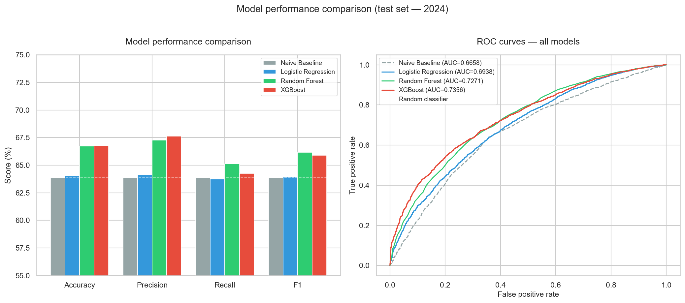
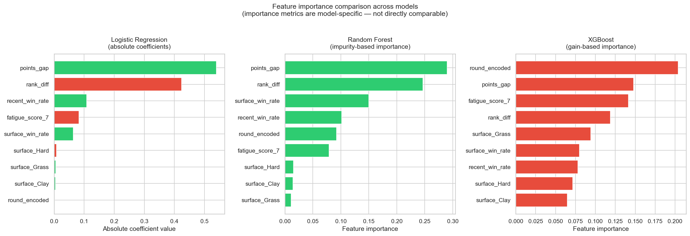
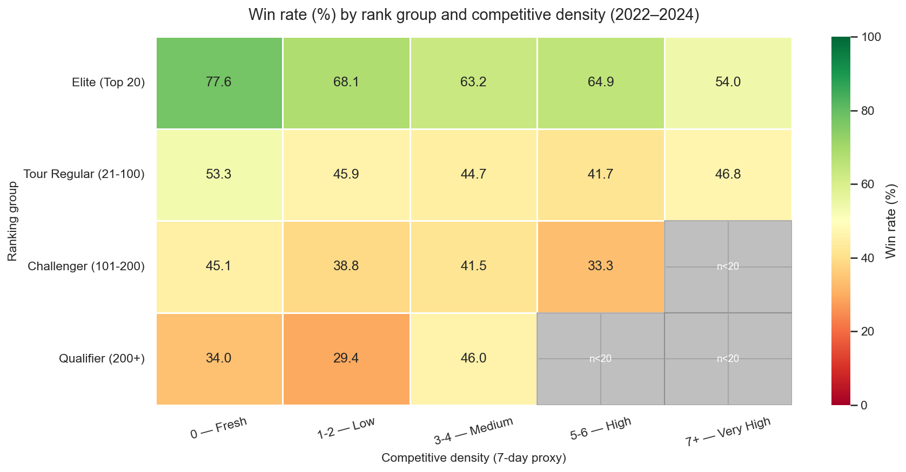
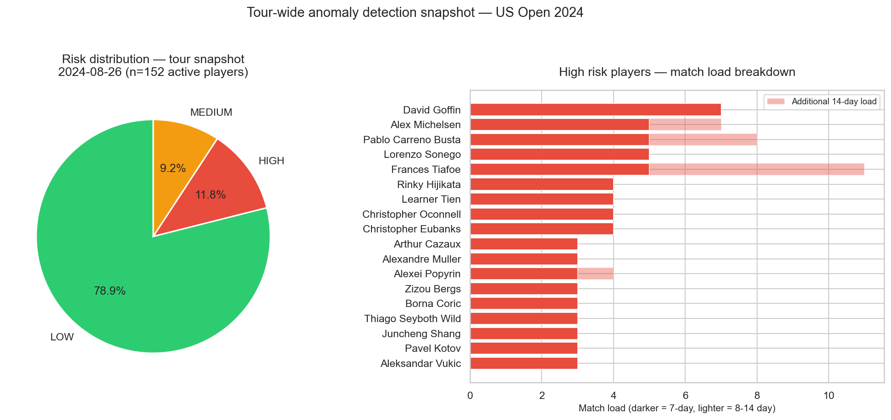

# Tennis Performance Analysis

A data science project analysing player performance, progression and match outcomes
across ATP tour events from 2022–2024. Inspired by real-world workflows used at
organisations like the International Tennis Federation (ITF).

---

## TL;DR

- Built an end-to-end tennis analytics pipeline covering EDA, player progression,
  junior pathway analysis, ML prediction and health monitoring
- Improved match outcome prediction beyond a ranking-only baseline (63.86% → 66.75%)
- Identified non-linear effects in tennis performance — fatigue, round context and
  surface preference interact in ways that linear models cannot capture
- Discovered that Next Gen win rate consistency predicts Senior success better than
  speed of improvement (r=0.718, p<0.001) — a non-obvious finding for junior pathway planning
- Designed a transferable analytical framework directly applicable to ITF wheelchair
  tennis workflows with appropriate data collection
- Designed as a transferable analytics framework aligned with real-world sports governing body workflows (e.g., ITF).

---

## Motivation

Professional tennis generates a vast amount of match data that remains largely
underutilised for performance analysis. This project explores what player rankings,
match outcomes, and workload data can tell us about how professional tennis players
actually perform — and how that performance can be tracked, predicted, and monitored
in a structured way.

---

## Project structure

```
Tennis_Performance_Analysis/
│
├── data/
│   ├── raw/                        # Raw ATP match data (not tracked by Git)
│   ├── processed/                  # Cleaned, analysis-ready dataset
│   │   ├── matches_cleaned.csv
│   │   └── matches_cleaned.xlsx
│   └── wheelchair/                 # ITF wheelchair tennis data
│
├── notebooks/
│   ├── 00_data_cleaning.ipynb
│   ├── 01_ranking_performance.ipynb
│   ├── 02_player_progression.ipynb
│   ├── 03_junior_pathway.ipynb
│   ├── 04_ml_match_prediction.ipynb
│   └── 05_health_fatigue.ipynb
│
├── outputs/
│   └── figures/                    # Exported chart images
│
├── app/                            # Optional Streamlit dashboard
│   └── app.py
│
├── README.md
├── requirements.txt
└── .gitignore
```

---

## Data sources

- **ATP Match Data:** Jeff Sackmann's tennis_atp dataset
  (github.com/JeffSackmann/tennis_atp)
- **Years used:** 2022, 2023, 2024 — COVID-disrupted seasons (2020–2021) excluded
- **ITF Wheelchair Tennis Rankings:** itftennis.com

---

## Narrative

This project was structured around five core questions, each mapping to a real
analytical challenge faced by sports governing bodies like the ITF:

1. Does ranking accurately predict performance — and at what levels does it break down?
2. How do players develop over time, and what archetypes exist?
3. What predicts a successful transition from junior to professional tennis?
4. Can match outcomes be predicted beyond ranking alone?
5. Does competitive load affect performance, and can we monitor player health at scale?

---

## Key findings

### Ranking & performance
- Points gap between players is a stronger predictor than ranking position alone —
  capturing quality magnitude rather than just ordinal position
- Elite players show higher win rates at Grand Slams (74.4% vs 68.4% at ATP 250/500),
  suggesting performance differences across tournament contexts
- Below the top 20, any player can beat any other on a given day — seeding offers
  limited predictive value outside the elite bracket




---

### Player progression
- Four distinct archetypes identified from data: rapid risers, declining players,
  elite consistent and breakthrough players — each with visually distinct trajectories
- A clear trade-off exists between speed of improvement and consistency —
  the fastest improving players are almost always the most volatile
- 21 players achieved a true breakthrough (outside top 100 → inside top 50)
  between 2022 and 2024 via two distinct templates: fast focused climbs and
  slow steady journeys




---

### Junior pathway
- Next Gen players (19–21) show the steepest improvement trajectory —
  median relative improvement of 46.96% vs 2.91% for Seniors
- **Most important finding:** Next Gen win rate consistency predicts Senior
  success (r=0.718, p<0.001) — speed of ranking improvement does not
  (r=0.130, p=0.546). Consistency matters more than trajectory.




---

### Match outcome prediction
- All three models outperform the naive baseline (63.86%) — XGBoost achieves
  66.75% accuracy and AUC of 0.7356
- Tree-based models outperform Logistic Regression, suggesting that non-linear
  feature interactions improve predictive performance in this dataset
- Ranking and points gap dominate all predictions — tennis outcomes are
  primarily structured by player quality hierarchy
- ~67% accuracy ceiling confirms tennis retains irreducible unpredictability




---

### Health & fatigue monitoring
- Competitive density shows a statistically significant but non-linear relationship
  with win rate (F=5.04, p=0.0005)
- The fatigue effect is rank-dependent — Elite players show the largest performance
  drop at high competitive density (77.6% → 54.0%)
- A personalised anomaly detection prototype was developed — 21% of players were
  flagged at US Open 2024 (18 High, 14 Medium risk out of 152 active players)
- **Important data limitation:** tournament date approximation affects load metric
  precision. Full ACWR implementation requires individual match dates.




---

## Notebooks

### 00 — Data cleaning & feature engineering
Prepares the raw ATP match data for analysis.

**Key decisions:**
- Dropped 24 irrelevant or high-missing columns
- Imputed missing match duration by surface and best_of group — more accurate
  than global median for fatigue monitoring
- Fixed naming inconsistencies and miscategorised tournament levels
- Created new tournament level 'T' for team events (ATP Cup, United Cup, Laver Cup)
- Reshaped from match format to player format — enabling balanced 50/50 ML target

**Output:** 17,654 rows × 21 columns, zero missing values

---

### 01 — Ranking & performance analysis
Analyses ranking groups, upset patterns, rank points gap and performance
across tournament levels. Introduces a performance matrix showing how
different rank groups perform across competition types.

---

### 02 — Player progression tracking
Tracks ranking trajectories across 237 players, identifying four data-driven
archetypes and analysing 21 breakthrough players in depth.

---

### 03 — Junior pathway analysis
Compares performance, improvement rate and volatility across U18, Next Gen
(19–21) and Senior (21+) career stages using match-level age classification.

---

### 04 — Match outcome prediction (ML)
Develops a tennis-informed prediction system using Logistic Regression,
Random Forest and XGBoost, evaluated against a naive ranking baseline.
Features selected based on tennis domain knowledge — including surface-specific
win rate and tournament-cycle-based recent form.

---

### 05 — Health & fatigue monitoring
Investigates competitive load vs performance and develops a personalised
anomaly detection system. A significant data limitation was discovered and
documented transparently — the methodology was adjusted rather than abandoned,
producing a concrete ITF data infrastructure recommendation.

---

## Applicability to wheelchair tennis

| Analysis | Wheelchair tennis application |
|---|---|
| Ranking analysis | ITF wheelchair Open and Quad division comparisons |
| Player progression | Junior wheelchair tennis pathway tracking |
| Junior pathway | Development stage transitions in wheelchair tennis |
| Match prediction | Wheelchair match outcome prediction with appropriate data |
| Health monitoring | **More critical** — wheelchair propulsion adds upper body load not captured in match duration alone |
| Classification | Digitisation of Open/Quad functional classification process |

A dedicated wheelchair tennis notebook was planned but not implemented due to
data availability — historical match data sufficient for progression tracking
and fatigue monitoring is not publicly available. A proposed classification
digitisation schema (not currently available in public dataset) would include:
player_id, classification_date, functional_score, division (Open/Quad) and
review_due_date.

---

## Future work

- **Surface & tournament analysis** — surface specialist scoring, deprioritised
  in favour of notebooks directly mapped to ITF responsibilities
- **Seasonal performance analysis** — splitting the ATP season into four phases
  to track performance variation across the year. Key challenge: surface and
  season phase are almost perfectly correlated in the ATP calendar, making it
  difficult to isolate a seasonal fatigue effect from a surface effect
- **Full ACWR implementation** — requires individual match dates rather than
  tournament start dates — the single highest-impact data collection improvement
- **Wheelchair tennis dedicated analysis** — requires historical ITF wheelchair
  tennis match data, individual match dates, and functional classification records

---

## Relevance to sports governing bodies

| Notebook | ITF use case |
|---|---|
| Ranking analysis (01) | Player ranking assessment, tournament seeding, upset anticipation |
| Player progression (02) | Tracking player progression data |
| Junior pathway (03) | Junior pathway training and competition testing |
| Match prediction (04) | Tournament assessment, ranking validation, talent identification |
| Health & fatigue (05) | Setting up a process to track player health on Tour |
| Wheelchair tennis applicability | Classification digitisation, junior pathway analysis |

---

## How to run

```bash
pip install -r requirements.txt
jupyter notebook
# Open notebooks in order starting with 00_data_cleaning.ipynb
```

---

## Tech stack

- Python 3.9
- pandas, numpy — data manipulation
- matplotlib, seaborn — visualisation
- scikit-learn, xgboost — machine learning
- scipy — statistical testing
- jupyter — notebook environment
- openpyxl — Excel compatibility

---

## Author

Vishal Saravanan — postgraduate student in Data Science and Artificial Intelligence
GitHub: github.com/VishalSaravanan02